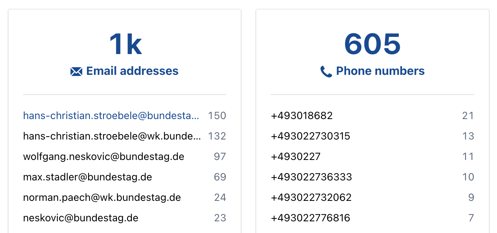

# Navigating Within Datasets

OpenAleph allows you to search within a specific dataset or investigation workspace. This scoped searching is useful when you want to focus your queries and avoid unrelated results.

## How to Search Within a Dataset

There are two primary ways to restrict your search to a specific dataset:

### 1. From the Dataset Page

1. Open the dataset from the **Datasets** tab.
2. Use the search bar within the dataset view—this automatically scopes your search to that dataset.

### 2. Using Filters

On a general search results page:

- Use the **Collection** filter in the left sidebar.
- Select the dataset(s) you want to search within.
- All search terms will now apply only to the selected dataset.

## Extracted `mentions` search

OpenAleph extracts a number of identifiers from the dataset during the ingestion process. You can click these from the overview page to see all entities or files that contain the identifier within the dataset.

## Source documents

If the dataset contains documents and folders, you will be able to browse these sources by clicking the source documents tab - similar to browsing folder structures on your computer.

---

Scoped searching makes it easier to stay focused on what matters most in your investigation. Combine it with [Advanced Search](advanced-search.md) techniques to zero in on exactly what you need.
